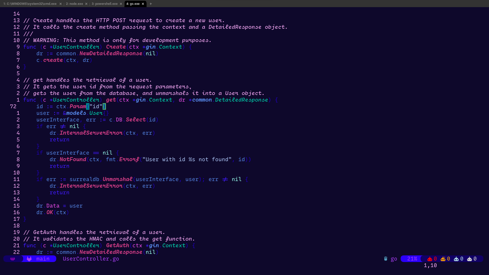
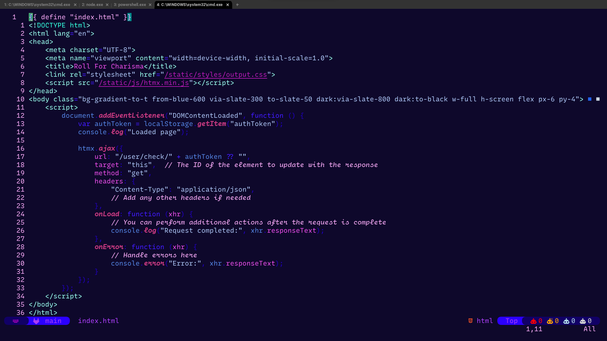
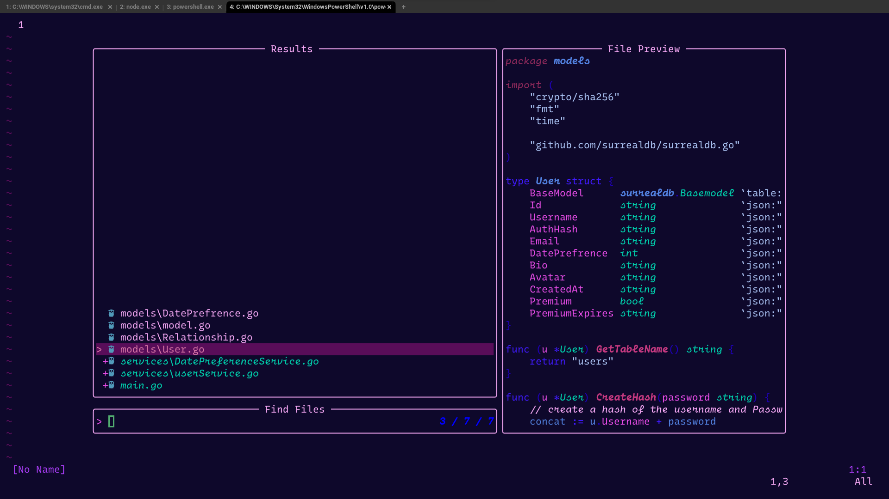
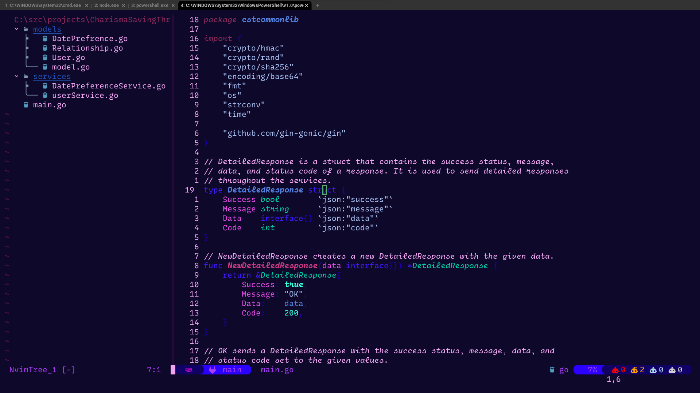

# Vaporlush

A vaporwave inspired Neovim theme made with [lush.nvim](https://github.com/rktjmp/lush.nvim)

## Supports:
- treesitter
- telescope
- fugitive
- 🆕 [Obsidian](https://github.com/epwalsh/obsidian.nvim)

## Preview
|                                                                           |                                                                           |
| ------------------------------------------------------------------------- | ------------------------------------------------------------------------- |
|  |  |
|  |  |

## Installation

- Using `vim-plug`:

```vim
Plug 'rktjmp/lush.nvim'
Plug 'adamkali/vaporlush'
```

- Using `packer`:

```lua
use { "adamkali/vaporlush", requires={ "rktjmp/lush.nvim" } }
```

- Using `lazy.nvim`:

```lua
{ "adamkali/vaporlush", dependencies={ "rktjmp/lush.nvim" } }
```

## Setup 
```lua
vim.api.nvim_command([[
    colorscheme vaporlush
]])
```

or

```vim
colorscheme vaporlush
```

or

```lua
vim.cmd("colorscheme vaporlush")
```

## Contributions
I use this colorscheme as my daily driver, as such the colorscheme is constantly being updated for what I want and _crave_. That being said, I am happy to take any suggestions via pull request.

## Credits
This colorscheme is built with [lush.nvim](http://git.io/lush.nvim); for more information on Lush and a helper script to setup your repo clone.
