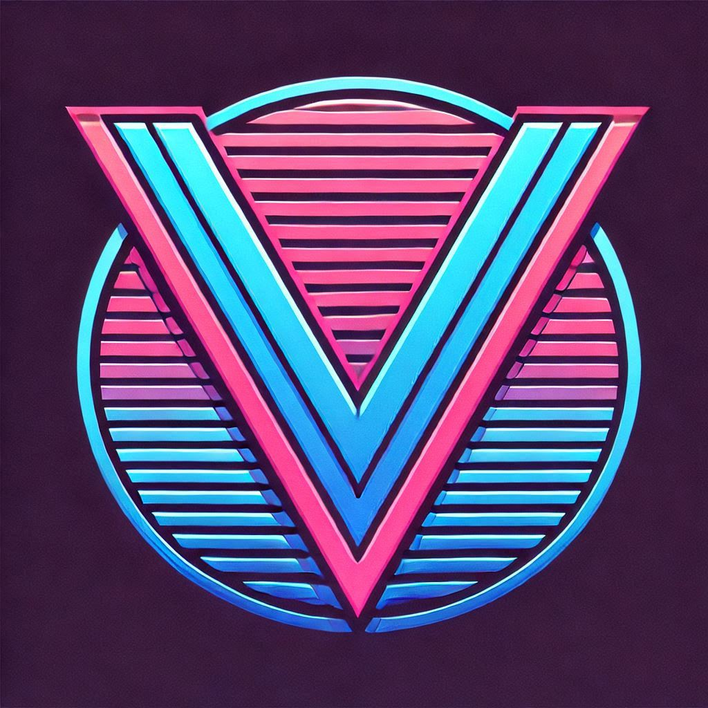
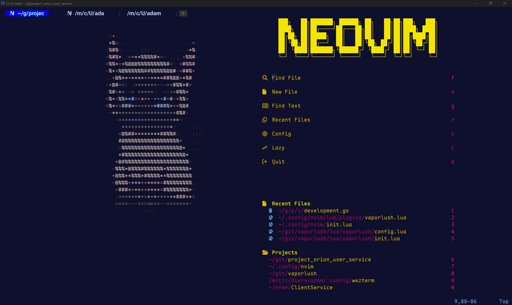
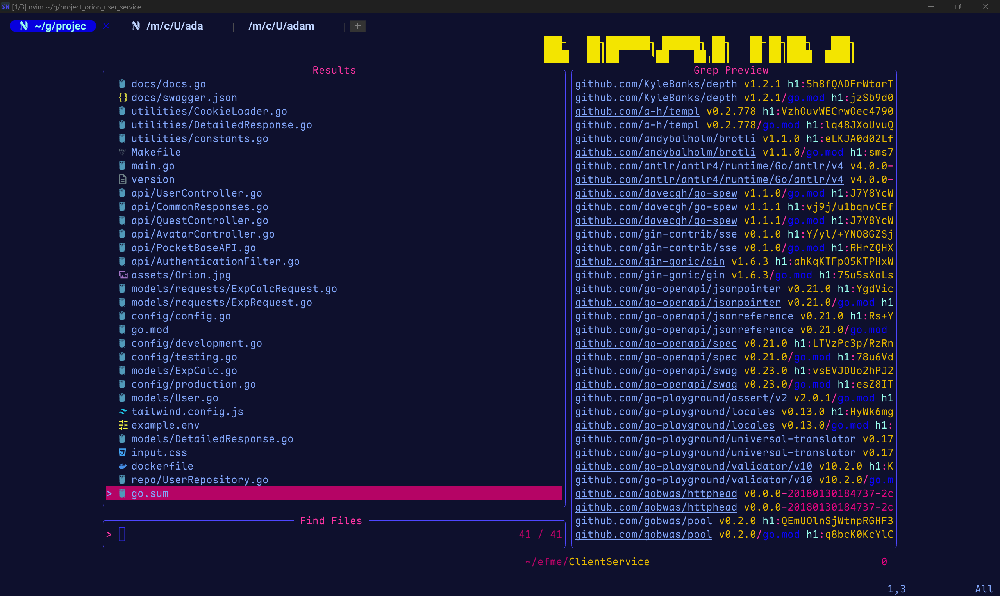
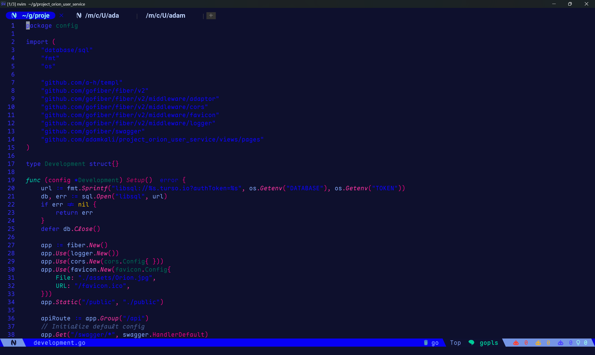
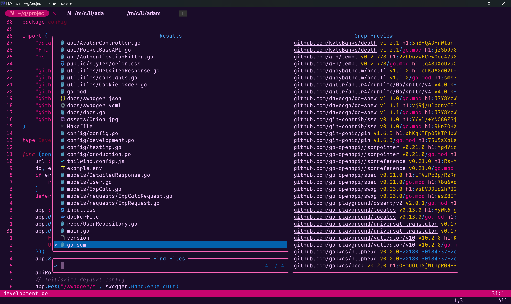
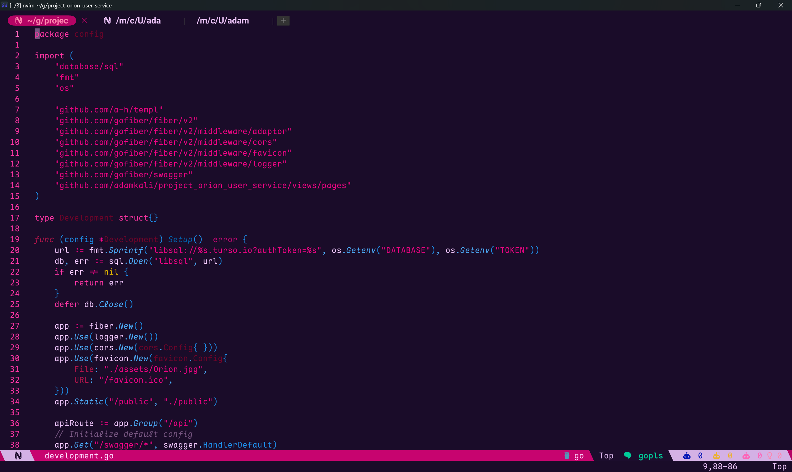

# Vaporlush V2



Absolutely Dank Vaporwave colorschemes :) 


## Preface 


Hi, adam here. A little backstory: vaporlush was an inspired Neovim theme made with [lush.nvim](https://github.com/rktjmp/lush.nvim) yet I loved my colorscheme so much that I wanted to make my colorscheme more personal. I orignally thought that making theh colorscheme from scratch was too daunting, and that was why I used [lush.nvim](https://github.com/rktjmp/lush.nvim) in the first place. And with this rewrite I wanted to still honor lush.nvim. It served me well and I encourage you to make your own colorscheme with it. That being said this takes alot of [tokyonight](https://github.com/folke/tokyonight.nvim) . So really this would not be possible with out it either. So if somehow you have not used tokyonight, check it out. 

Vaporlush V2 contains currently the following colorschemes: 

### Vapor 
The orignal vaporlush look spruced up a little for more contrast, and updated colors for  less clashing.

### Blossom
The Neon Cherry Blossom colorscheme.

### 1996
A Dark green vibes based colorscheme. 

Anyways Vaporize me captain!

## Install

> [!CAUTION]
>  This is a Work in progress. And is subject to chonge rapidly. However most functionality has been ironed out; hence the WIP warning. `CursorColumn` specifically is not properly overiding some hl groups for examples. So if you do not use Rulers, this wont effect you. Other bugs are similarly like this. Not horrible breaking bugs, but things that I would not appreciate.

### Install with Lazy

```lua
{
    "adamkali/vaporlush",
    branch = "v2", -- must be set until stable 
    lazy = false,
    priority = 1000,
    opts = {
        cache = true, -- cache the currently held colorscheme 
        style = 'vapor'
        -- style = 'blossom'
        -- style = '1996'
    }
},
```

### Lualine
When using lualine, this is the setup I go with: 
```lua
    {
        'nvim-lualine/lualine.nvim',
        dependencies = { 'adamkali/vaporlush' },
        opts = {
            theme = 'vaporlush',
            -- any other configuration should be continued here
        }
    }
```

This will load in [vaporlush.lualine](./lua/lualine/themes/vaporlush.lua) and apply the currently loaded in colorscheme. And as a result, allows you to just change `opts.style = <scheme>` in vaporlush's opts table to change vaporlush as well.

## Preview

### Vaporlush.Vapor 


  
  


### Vaporlush.Blossom


  
  


