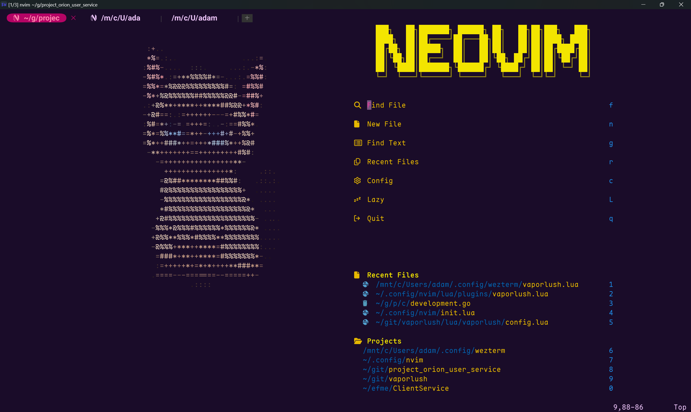

# Vaporlush V2


An absolutely dank Neovim Colorscheme

## Preface 

Hi, adam here. A little backstory: vaporlush was an inspired Neovim theme made with [lush.nvim](https://github.com/rktjmp/lush.nvim) yet I loved my colorscheme so much that I wanted to make my colorscheme more personal. I orignally thought that making theh colorscheme from scratch was too daunting, and that was why I used [lush.nvim](https://github.com/rktjmp/lush.nvim) in the first place. And with this rewrite I wanted to still honor lush.nvim. It served me well and I encourage you to make your own colorscheme with it. That being said this takes alot of [tokyonight](https://github.com/folke/tokyonight.nvim) . So really this would not be possible with out it either. So if somehow you have not used tokyonight, check it out. 

Vaporlush V2 contains currently the following colorschemes: 

### Vapor 
The orignal vaporlush look spruced up a little for more contrast, and less clashing colors in some cases.

### Blossom
The Neon Cherry Blossom colorscheme.

### Ninetysix 
A light-themed version of Vaporwave with some softer colors.

Anyways Vaporize me captain!

## Install


### Install with Lazy
```lua
{
    "adamkali/vaporlush",
    branch = "v2",
    lazy = false,
    priority = 1000,
    opts = {
        cache = true,
        style = 'vapor'
        -- style = 'blossom'
        -- style = '1996'
    }
},
```

## Preview

### Vaporlush.Vapor 


  
  


### Vaporlush.Blossom


  
  


